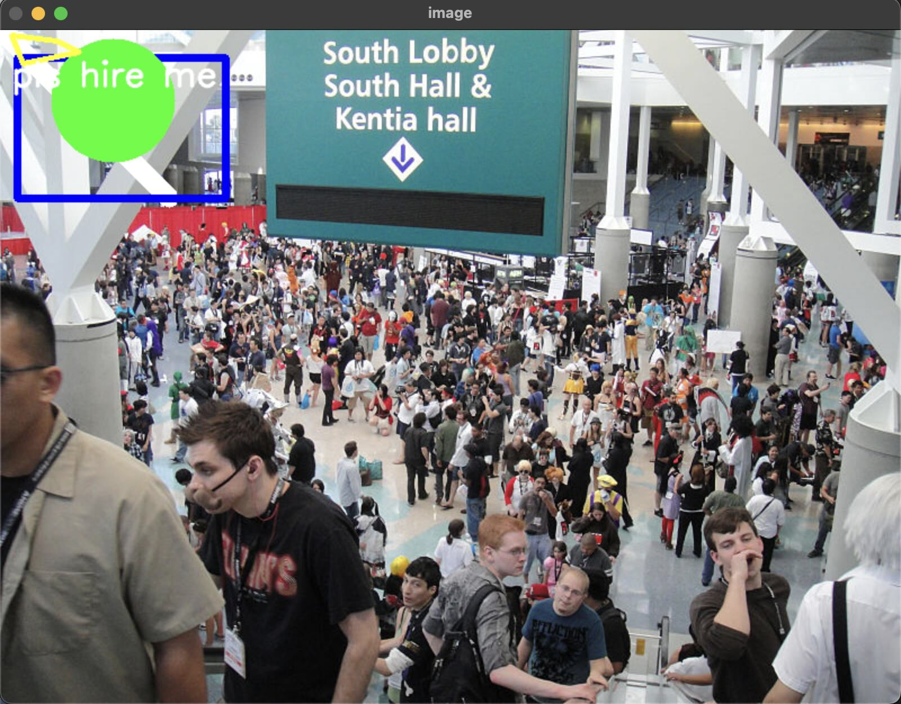
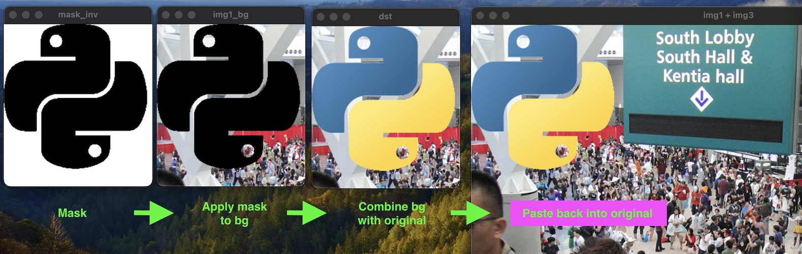

# Lesson Notes


## lesson3.py

File: 

```python
import numpy as np
import cv2

img = cv2.imread('./images/crowd.jpg', cv2.IMREAD_COLOR)

# Draw basic shapes
cv2.line(img, (0, 0), (150,150), (255, 255, 255), 15)
cv2.rectangle(img, (15, 25), (200, 150), (255,0,0),5)
cv2.circle(img, (100, 63), 55, (0, 255, 0), -1)

# Draw arbitrary polygon
pts = np.array([[10, 5], [20,30], [70, 20],[50,10]], np.int32)
cv2.polylines(img, [pts], True, (0, 255, 255), 3)

# Text!
font = cv2.FONT_HERSHEY_SIMPLEX
cv2.putText(img, "pls hire me", (10, 50), font, 1, (255, 255, 255), 2, cv2.LINE_AA)

cv2.imshow('image', img)
cv2.waitKey(0)
cv2.destroyAllWindows()

```

Generated Image:


# lesson5.py

```python

img3gray = cv2.cvtColor(img3, cv2.COLOR_BGR2GRAY)
ret, mask = cv2.threshold(img3gray, 230, 255, cv2.THRESH_BINARY_INV)

mask_inv = cv2.bitwise_not(mask)                    # invert mask
img1_bg = cv2.bitwise_and(roi, roi, mask=mask_inv)  # get bg of img1 where mask is _not_ set
img3_fg = cv2.bitwise_and(img3, img3, mask=mask)    # get fg of img3 where mask _is_ set
dst = cv2.add(img1_bg, img3_fg)                     # paste img3_fg on top of img1_bg
img1[0:rows, 0:cols] = dst                          # overwrite img1 with result

```




