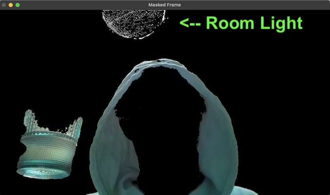
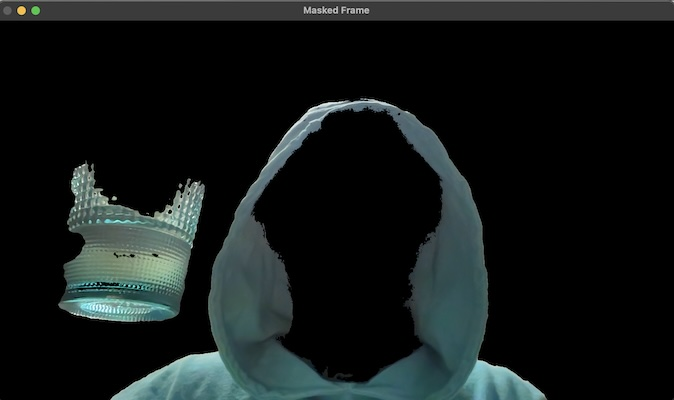
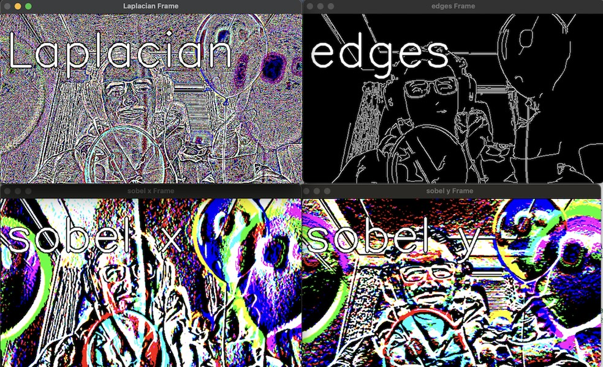
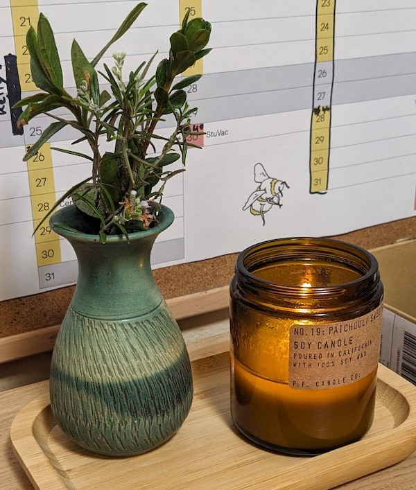
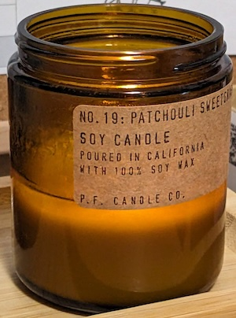
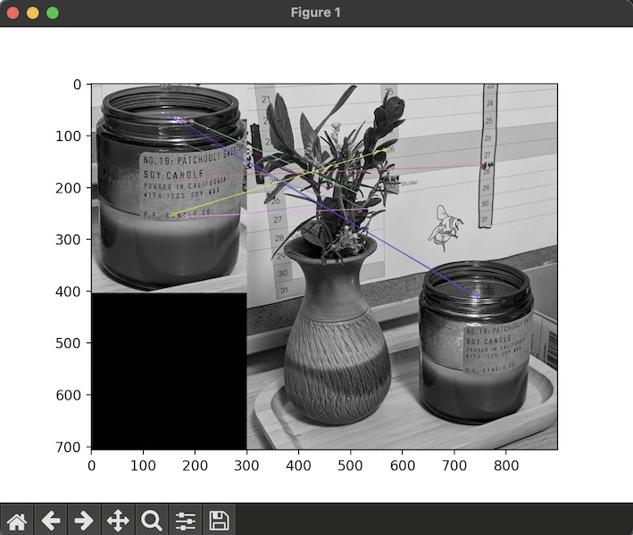
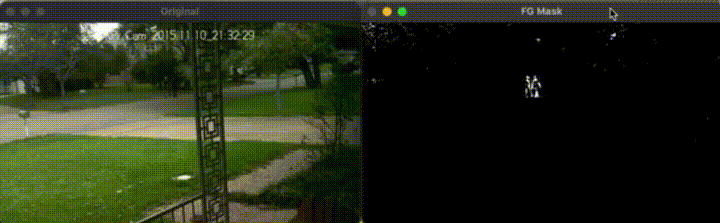

# Lesson Notes


## lesson3.py

File: 

```python
import numpy as np
import cv2

img = cv2.imread('./images/crowd.jpg', cv2.IMREAD_COLOR)

# Draw basic shapes
cv2.line(img, (0, 0), (150,150), (255, 255, 255), 15)
cv2.rectangle(img, (15, 25), (200, 150), (255,0,0),5)
cv2.circle(img, (100, 63), 55, (0, 255, 0), -1)

# Draw arbitrary polygon
pts = np.array([[10, 5], [20,30], [70, 20],[50,10]], np.int32)
cv2.polylines(img, [pts], True, (0, 255, 255), 3)

# Text!
font = cv2.FONT_HERSHEY_SIMPLEX
cv2.putText(img, "pls hire me", (10, 50), font, 1, (255, 255, 255), 2, cv2.LINE_AA)

cv2.imshow('image', img)
cv2.waitKey(0)
cv2.destroyAllWindows()

```

Generated Image:


# lesson5.py

```python

img3gray = cv2.cvtColor(img3, cv2.COLOR_BGR2GRAY)
ret, mask = cv2.threshold(img3gray, 230, 255, cv2.THRESH_BINARY_INV)

mask_inv = cv2.bitwise_not(mask)                    # invert mask
img1_bg = cv2.bitwise_and(roi, roi, mask=mask_inv)  # get bg of img1 where mask is _not_ set
img3_fg = cv2.bitwise_and(img3, img3, mask=mask)    # get fg of img3 where mask _is_ set
dst = cv2.add(img1_bg, img3_fg)                     # paste img3_fg on top of img1_bg
img1[0:rows, 0:cols] = dst                          # overwrite img1 with result

```


# Lesson 7

Filtering hue (after converting to HSV) to mask everything except my hoodie + cup.



Removed Light after clipping saturation.



# Lesson 10

Various techniques used in edge detection. `edges` is CV2's built in.



# Lesson 14

Sub-par object descriptors meant that the matches were poor : (

Scene:



Match:



Result: 




# Lesson 15



Screencap video converted with:
```bash
ffmpeg -i docs/lesson15-demo.mov -vf "fps=10,scale=720:-1:flags=lanczos" -loop 0 docs/lesson15-demo-3.gif
```


# Lesson 17 - Create Haar Cascade

1. Collect **negative** images
Any images will do as long as the image is not in them. Will need 3000+ ideally.

2. Collect **positive** images
Thousands of images of your own image. 
```shell
opencv_createsamples -img lesson15-measuring_tape_50x50.jpg  -bg bg.txt -info info/info.lst -pngoutput info -maxxangle 0.5 -maxyangle 0.5 -maxzangle 0.5 -num 1950
```

Finding a measuring tape:


3. Create a positive vector file
Done by stitching together all positives. OpenCV does the heavy lifting: 
```shell
opencv_createsamples -info info/info.lst -num 1950 -w 20 -h 20 -vec positives.vec
```

4. Train cascade.
OpenCV command: 
```shell
opencv_traincascade -data data -vec positives.vec -bg bg.txt -numPos 1800 -numNeg 900 -numStages 10 -w 20 -h 20
```

Notes:
- want negative images larger than positive images if you are synthesizing samples (rather than collecting and labeling)
- use small images (100x100 for neg, 50x50 for pos)
- aim to have double the number of positive images for training

Using: 
- Using [Image Net](https://www.image-net.org/) to get images


__**NOTE**__
Skipping 17-21 until I can find an alterantive to ImageNet
as it's only available to educational institutions now : (

Other Notes:
- increasing size of training data will quickly increase memory demand
- the cascade will only find images of the same size of training data
- will find a fun home project to actual try this on rather than just going through the motions
